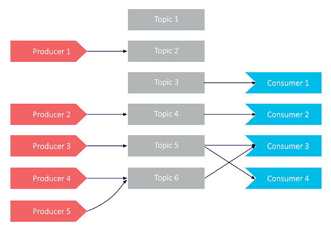
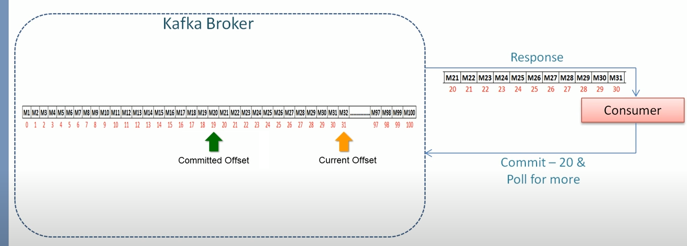
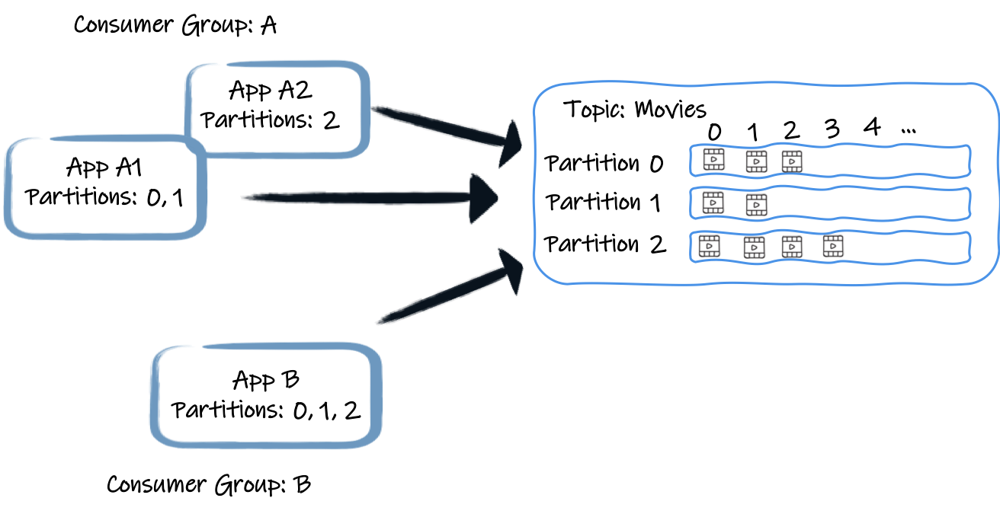
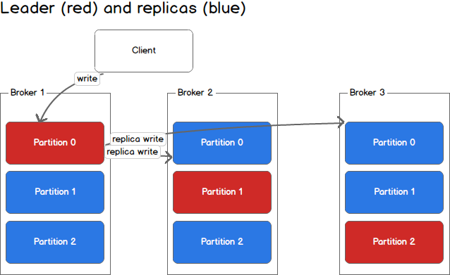

### Kafka

* <span style="color:blue">Kafka</span> - is a message broker.
* <span style="color:blue">Topic</span> - это именованный поток сообщений.
* <span style="color:blue">Producer</span> посылает сообщение в один топик, <span style="color:blue">cоnsumer</span> потребляет из множества топиков.



### Kafka Consumer Group and Offsets

* <span style="color:blue">Partition</span>  - это упорядоченный набор сообщений, это часть топика. 
Каждый topic разбивается на партиции для репликации данных (replica) и повышение быстродействия (parallel consumers).
Sending a message to a topic appends it to the selected partition. 
* <span style="color:blue">Offset</span> - это порядковый уникальный номер сообщения в партиции. Полный адрес сообщения можно записакть как: <span style="color:red">{topic, partition, offset}</span>.
* <span style="color:blue">Current Offset</span> - это номер последнего добавленного сообщения.
* <span style="color:blue">Commited Offset</span> - это номер последнего успешно обработанного сообщения.
* <span style="color:blue">Consumer offset commit</span> - когда потребитель обрабатывает сообщение он информирует кафку об offset 
последнего обработанного сообщения, если потребитель остановится и вновь подключится, то он получит все сообщения начиная с последнего commited offset.



* <span style="color:blue">Consumer group</span> - это группа однотипных потребителей сообщений, обрабатывающих сообщения параллельно.Kafka хранит offset в партиции для каждого потребителя.
Consumer group получает сообщения из топика один раз, один потребитель может быть подписан на 1..* партиций, партиция посылает сообщения только одному потребителю из группы(!)
=> число партиций определяет степень параллелизма обработки сообщений:




### Replicas

* Replicas are copies of partitions.
* Replicas are maintained for high availability and fault tolerance
* No two replicas of same partition will ever reside in the same broker
* <span style="color:blue">Leader</span>
  * Out of the replicated partitions, exactly one of the replica is elected as a Leader
  * Kafka clients can only read from and write to leader replica
  * Other replicas fetch messages from the leader
* <span style="color:blue">In-Sync Replica ISR</span>
  * Replicas which have same latest offset as the leader
  * When leader goes down, one of the ISR is chosen as the leader  
  * The record is considered “committed” when all isrs for partition wrote to their log. only committed records are readable from consumer. 
  another partition can be owned by another leader on another kafka broker.
  


### Kafka inside docker

* use docker-compose project
* start containers
```bash
sudo docker-compose up -d
```
* stop
```bash
sudo docker-compose down -v
```
* auto-start
always 	Always restart the container if it stops. If it is manually stopped, it is restarted only when Docker daemon restarts or the container itself is manually restarted. 
```
sudo docker-compose up -d --restart always redis
```
* send message to qr-tablet-topic
```bash
sudo docker exec -it kafka /opt/kafka/bin/kafka-console-producer.sh --broker-list localhost:19092 --topic tmc-topic
```
* показать все топики:
```bash
sudo docker exec -it kafka /opt/kafka/bin/kafka-topics.sh --list --bootstrap-server localhost:9092
```

* consume messages qr-tablet-topic
```bash
sudo docker exec -it kafka /opt/kafka/bin/kafka-console-consumer.sh --bootstrap-server localhost:19092 --topic fbucks-topic
#on sandbox
docker exec -it kafka bash -c "unset JMX_PORT && /opt/kafka/bin/kafka-console-consumer.sh --bootstrap-server localhost:9092 --topic department-topic"
```
* consume messages from multiple topics (using regular expressions)
```bash
sudo docker exec -it kafka /opt/kafka/bin/kafka-console-consumer.sh --bootstrap-server localhost:9092 --whitelist '.*'
```
* kafka на sandbox.foodband.ru, контейнер с именем kafka, compose лежит в: /srv/fbadmin/kafka
* создать топик:
```bash
docker exec -it kafka /opt/kafka/bin/kafka-topics.sh --bootstrap-server kafka:9092 --create --topic qr-tablet-topic --partitions 1 --replication-factor 1
```
